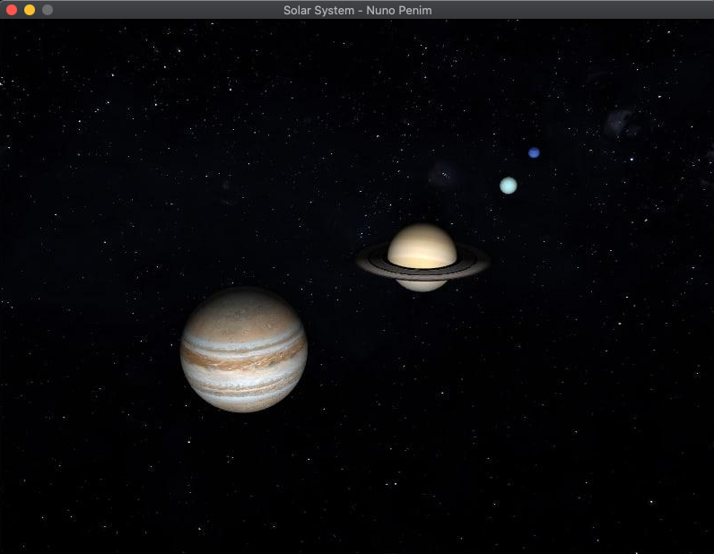

# SolarSystemOpenGL

Nuno Penim, 2020
> Licensed under [DBADPL-B](https://github.com/nunopenim/DBADPL-B)

Graphical Computing Final project.

Planets and sun are not to real scale or distances. Rendering distance would need to be huge for that. Currently They are on Multiples of the actual distance.

C++ and GLSL are the main programming languages of this project.

## How to render

The following guide is for macOS Catalina 10.15.X. There are also a [Windows version](https://github.com/nunopenim/SolarSystemOpenGL-Windows) and a [Linux version](https://github.com/nunopenim/SolarSystemOpenGL-Linux) of the project.

First make sure that you have all the required dependencies installed. To install them, run the following command:

`brew install gcc glew glfw3`

Make sure to also have GLAD and OpenGL headers installed. An excellent guide (not mine), in how to do this, can be found [here](https://giovanni.codes/opengl-setup-in-macos/)

Lastly, compile! To do such, on the top of the directory, type:

`make`

This will create an executable named solarSystem in the main directory and automatically execute it.

Now, wait, as depending on your machine it can take a bit to open. Use WASD to move, the mouse to look around and shift key to move faster. The camera is above the sun, so if you only see stars, look down first to see the sun, then you can locate the planets! Have fun :)

To build the executable file, just type:

`make build`

This will not run automatically the program. Like this, you can afterwards run it via `./solarSystem`, or transfer to another machine and execute it there, and use the same command. The executable file is named `solarSystem`.

There is also a rule in the Makefile to clean the output of the compilation, for a clean build:

`make clean`

For better organization, there will be added in future an output directory, to keep the executable.

## Information

Soon, an XCode version will be released, when I figure out why XCode is complaining about the "wtypes.h" include, in Window.cpp.

### Issues

For any issues with this, you can use the GitHub issues tab. I appreciate if you write [ISSUE] at beginning of the title, although this is not a strict requirement.

### Suggestions

Suggestions are always welcome, use the GitHub issues tab but write it as [SUGGESTION] in the title, so that I can separate what's urgent and what's not urgent.

### Contributions

Contributions are also welcome, be it in a text idea, which I consider a suggestion (view above!), or via code itself. For the latter, you can fork the repo, do your changes and then perform a pull request. I will analyse what you did, and I decide what makes to the main project or not. Although this project is no longer under active development, it never is finished.

### Using this project

The project is licensed under the DBADPL-B (Don't Be A Dick Public License B) . It means you can use it for whatever you want, the way you want, however if little or no changes were made, I appreciate credits.

Using it for educational or demonstration purposes is welcome and more than allowed (actually a bit flattering too!). So feel free to use it.

If however you use this for any commercial purpose and get rich out of it, I would appreciate a beer or a pizza too, as it is explained in the license file. Thanks for understanding and enjoy the project!
